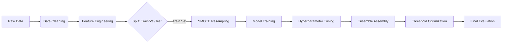

# 📘 Student Success Prediction Pipeline: Engineer's Guide

## Overview
This document serves as a comprehensive technical guide to the Student Success Prediction pipeline. It is designed for future engineers and interns to understand not just *how* the pipeline works, but *why* specific architectural and engineering decisions were made.

---

## 1. Pipeline Architecture
The pipeline is orchestrated by `run_pipeline.py` and implemented in `src/train_pipeline.py`. It follows a strict sequential workflow designed to prevent **data leakage** and ensure **reproducibility**.

### **High-Level Data Flow**

### **Key Architectural Decisions**
1.  **Leakage Guard**: We explicitly drop features that would not be available at the time of prediction (e.g., 2nd-semester grades if predicting early). This is handled in `DataLoader._apply_leakage_guard`.
2.  **Post-Split Resampling**: **CRITICAL**. SMOTE (Synthetic Minority Over-sampling Technique) is applied *only* to the training set *after* splitting.
    *   *Why?* If we upsample before splitting, synthetic copies of a validation point could end up in the training set, causing massive overfitting (data leakage).
3.  **Macro F1 Optimization**: We optimize for Macro F1 rather than Accuracy.
    *   *Why?* The "Enrolled" class is a minority. A model that ignores "Enrolled" students can still get high accuracy but fails the business objective of identifying at-risk students.

---

## 2. Deep Dive: Feature Engineering
Located in: `src/data/feature_engineering.py`

Feature engineering is the "secret sauce" of this pipeline. We transform raw transactional data into behavioral signals.

### **Category 1: Academic Trajectory (`AcademicFeatures`)**
Raw grades capture a static snapshot. We care about *momentum*.

| Feature | Logic | Rationale |
| :--- | :--- | :--- |
| `grade_improvement` | `Sem2_Grade - Sem1_Grade` | A student improving from 10→12 is safer than one dropping 14→12. |
| `approval_rate` | `Units_Approved / Units_Enrolled` | Measures efficiency. Low approval rate (<50%) is a massive red flag. |
| `eval_efficiency` | `Units_Evaluated / Units_Enrolled` | Measures effort. A student who enrolls but doesn't show up for exams (0 evals) is "ghosting". |

### **Category 2: Engagement Signals (`EngagementFeatures`)**
Dropout is rarely sudden; it's a process of disengagement.

| Feature | Logic | Rationale |
| :--- | :--- | :--- |
| `course_load_change` | `Sem2_Enrolled - Sem1_Enrolled` | A sudden drop in course load often precedes dropout. |
| `units_without_eval` | `Enrolled - Evaluated` | The "Ghosting" metric. High values indicate the student has mentally checked out. |
| `engagement_risk_score` | Composite Score (0-5) | Combines load reduction, ghosting, and zero-enrollment flags into a single integer risk level. |

### **Category 3: Financial Risk (`FinancialFeatures`)**
Financial stress is a primary driver of dropout.

| Feature | Logic | Rationale |
| :--- | :--- | :--- |
| `financial_risk` | `Debtor OR Unpaid_Tuition` | Binary flag. If a student owes money, they are administratively blocked from re-enrolling. |
| `economic_stress_index` | `Norm(Unemployment) + Norm(Inflation) - Norm(GDP)` | Macro-economic context. Students drop out more during economic downturns. |
| `financial_vulnerability` | `Personal_Risk + Macro_Risk` | Interaction term. A debtor in a bad economy is at maximum risk. |

### **Category 4: Demographic Context (`DemographicFeatures`)**
Used to identify students needing specific support structures.

| Feature | Logic | Rationale |
| :--- | :--- | :--- |
| `family_education_avg` | `(Mother_Qual + Father_Qual) / 2` | Proxy for "First Generation Student". These students often lack family guidance on navigating university bureaucracy. |
| `is_mature_student` | `Age > 25` | Mature students face different pressures (jobs, kids) than 18-year-olds. |

---

## 3. Model Specifications
Located in: `src/models/`

We use tree-based models because they naturally handle non-linear interactions (e.g., *High Tuition is bad, UNLESS Scholarship is True*).

### **1. Random Forest (`RandomForestModel`)**
*   **Role**: The stabilizer. Low variance, hard to overfit.
*   **Key Params**:
    *   `class_weight='balanced'`: Penalizes mistakes on minority classes more heavily.
    *   `oob_score=True`: Uses "Out-of-Bag" samples for free validation during training.

### **2. XGBoost (`XGBoostModel`)**
*   **Role**: The performance driver.
*   **Mechanism**: Sequential boosting. Tree 2 fixes Tree 1's mistakes.
*   **Key Params**:
    *   `scale_pos_weight`: Adjusted dynamically for class imbalance.
    *   `early_stopping_rounds`: Prevents overfitting by stopping training when validation score plateaus.

### **3. LightGBM (`LightGBMModel`)**
*   **Role**: Speed and efficiency.
*   **Mechanism**: Leaf-wise growth (grows complex trees faster).
*   **Note**: Can overfit on small datasets, so we heavily regularize `min_child_samples`.

---

## 4. Threshold Optimization (The "Hidden" Booster)
Standard models predict a class if Probability > 0.5. This is suboptimal for imbalanced data.

**Our Approach (`ThresholdOptimizer`):**
1.  We get raw probabilities from the model (e.g., `[0.6, 0.3, 0.1]` for `[Dropout, Enrolled, Graduate]`).
2.  We apply custom multipliers found via Grid Search on the validation set.
    *   *Example*: Multiply "Enrolled" probability by 1.2x.
3.  **Result**: The model becomes more sensitive to the "Enrolled" class, significantly boosting Macro F1 without retraining.

---

## 5. Guide for Interns & Future Work

### **How to Add a New Feature**
1.  Open `src/data/feature_engineering.py`.
2.  Create a new Transformer class (e.g., `SocialFeatures`).
3.  Implement `transform()`. **Rule**: Must handle missing values and division-by-zero.
4.  Add it to `StudentFeatureEngineer.__init__`.

### **How to Add a New Model**
1.  Open `src/models/`.
2.  Create a wrapper class (e.g., `SVMModel`) that implements `fit()`, `predict()`, and `predict_proba()`.
3.  Add it to the `train_baselines()` or `train_ensembles()` method in `TrainingPipeline`.

### **Common Pitfalls to Avoid**
*   **Target Leakage**: Never use features that reveal the future (e.g., "Date of Graduation").
*   **Data Snooping**: Never fit scalers or encoders on the *entire* dataset. Always `fit` on Train, `transform` on Test.
*   **Metric Fixation**: Don't just look at Accuracy. Always check the **Confusion Matrix** in `artifacts/plots/` to see *who* is being misclassified.
